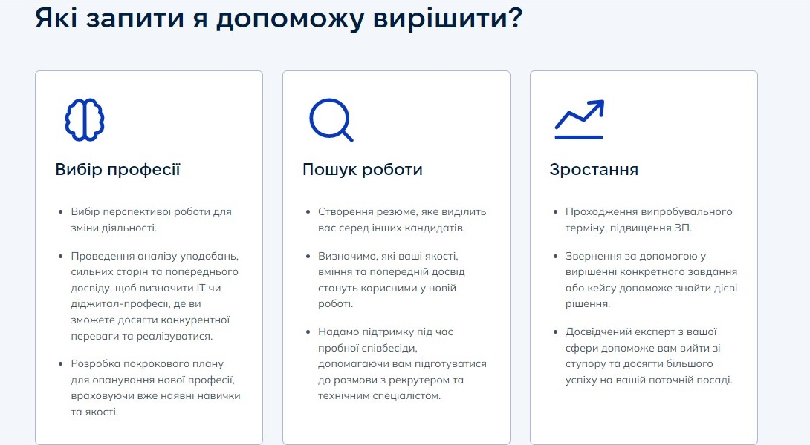
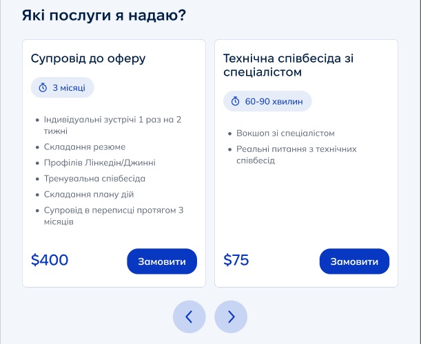
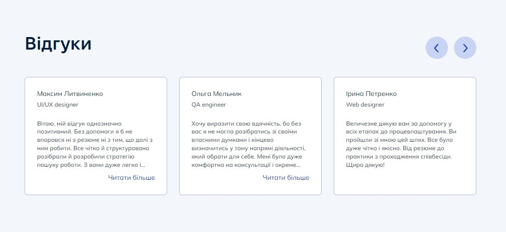
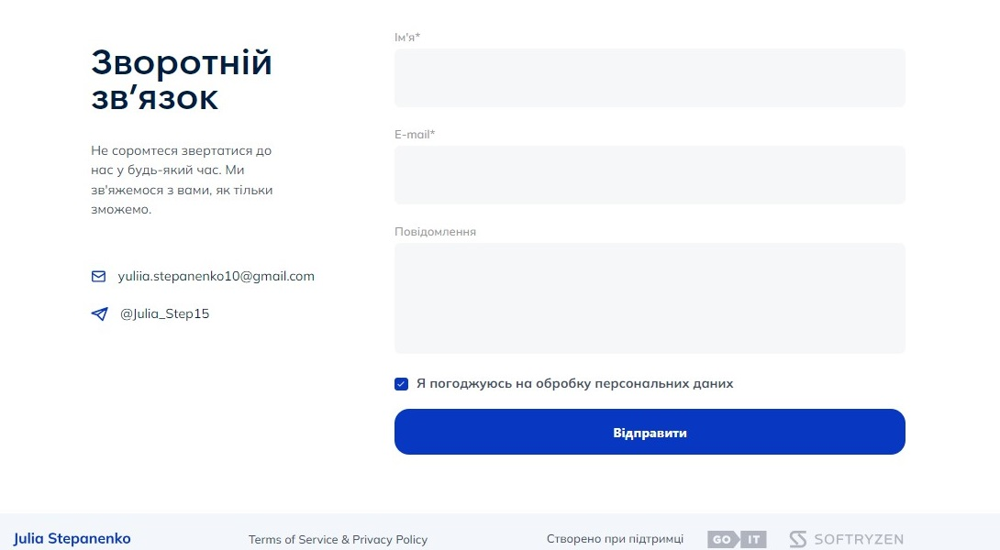

# Career consultant

**[LIVE PAGE](https://career-consultant.vercel.app/)**


<p align="center">
  <a href="#introduction">Introduction</a> •
  <a href="#features">Features</a> •
  <a href="#components-api">Components API</a> •
  <a href="#credits">Credits</a> •
  <a href="#getting-started">Getting started</a>
</p>

## Introduction

`Career consultant` is a web application aimed at career counseling for
Ukrainians who want to receive a clear action plan, practical tools, and
support.

## Features

Website consists from 2 pages: Main & Privacy Policy. </br>The layout is
responsive and cross-browser compatible - mobile starts from 360px, tablet from
768px, desktop from 1280px. The layout from 360px to 480px is fluid
(stretchable). Used mobile-first approach.

### Sections

- **Header**: Contains a logo and a navigation menu. Each menu item is clickable
  and performs smooth scrolling to the respective section on the page. A mobile
  menu is used for the mobile and tablet versions.
- **Hero**: Contains four components, the data of which can be edited using the
  Sanity admin panel. The mobile version includes a slider. The slider is
  infinite, swipable, and automatically transitions one card at a time.
- **Requests**: On the desktop version, it consists of cards, while on the
  tablet and mobile versions, it features a slider with navigation buttons.
- **Services**: Contains an infinite slider. Cards can be deleted and added via
  the Sanity admin panel.
- **What to choose**: Static section with a button to redirect to the Telegram
  messenger.
- **Reviews**:There is a slider with navigation buttons. Data can be edited
  using the Sanity admin panel.
- **Feedback**: Contains links to social networks and a feedback form.

<details>
<summary>
 Sections preview
</summary> <br />

<p align="center">
    
&nbsp;
    
</p>

<p align="center">
    
&nbsp;
    
</p> 
    
<p align="center">
    
&nbsp;
    
</p>
    
</details>

## Components API

Here you may find a list with the most common components:

- #### Button

| Prop            | Value               | Description                         |
| --------------- | ------------------- | ----------------------------------- |
| `children`      | `string`            | required, button text               |
| `type`          | `button` / `submit` | required, button type               |
| `onClick`       | `function`          | optional, add effect on click event |
| `isSubmitted`   | `boolean`           | optional, set submitted styles      |
| `isSubmitError` | `boolean`           | optional, set submit error styles   |
| `disabled`      | `boolean`           | optional, set disable styles        |

- #### Container

| Prop        | Value       | Description                        |
| ----------- | ----------- | ---------------------------------- |
| `children`  | `ReactNode` | required, element inside Container |
| `className` | `string`    | optional, add additional styles    |

- #### Input

| Prop        | Value                                      | Description                                                                                          |
| ----------- | ------------------------------------------ | ---------------------------------------------------------------------------------------------------- |
| `name`      | `name` / `email` / `message` / `checkbox`  | required, set name of the field in the form, which will be used for registration and data collection |
| `label`     | `string`                                   | required, label text                                                                                 |
| `type`      | `text` / `email` / `textarea` / `checkbox` | optional, change input type & set styles accordingly                                                 |
| `className` | `string`                                   | optional, add additional styles                                                                      |

- #### LinkToFeedback

| Prop        | Value                                         | Description                           |
| ----------- | --------------------------------------------- | ------------------------------------- |
| `section`   | `header` / `hero` / `services` / `mobileMenu` | required, set styles for each section |
| `className` | `string`                                      | optional, additional styles           |
| `onClick`   | `function`                                    | optional, add effect on click event   |

- #### Section

| Prop                        | Value       | Description                      |
| --------------------------- | ----------- | -------------------------------- |
| `children`                  | `ReactNode` | required, element inside Section |
| `className`                 | `string`    | optional, additional styles      |
| `isHerosection`             | `boolean`   | optional, set specific styles    |
| `isTopPadding`              | `boolean`   | optional, set specific styles    |
| `isBottomPadding`           | `boolean`   | optional, set specific styles    |
| `isChooseOrFeedbackSection` | `boolean`   | optional, set specific styles    |
| `sectionId`                 | `string`    | optional, set section id         |

- #### SectionTitle

| Prop        | Value     | Description                   |
| ----------- | --------- | ----------------------------- |
| `text`      | `string`  | required, title text          |
| `className` | `string`  | optional, additional styles   |
| `center`    | `boolean` | optional, set specific styles |

- #### Slider

| Prop        | Value                                        | Description                                                   |
| ----------- | -------------------------------------------- | ------------------------------------------------------------- |
| `data`      | `array`                                      | required, data for slider cards                               |
| `component` | `component`                                  | required, component that should be rendered inside each slide |
| `section`   | `requests` / `hero` / `services` / `reviews` | required, set specific options                                |

## Credits

This software uses the following open source packages:

- [Next.js](https://nextjs.org/)
- [Sanity](https://www.sanity.io/)
- [TypeScript](https://www.typescriptlang.org/)
- [Tailwindcss](https://tailwindcss.com/)
- [HeadlessUI](https://headlessui.com/)
- [Swiper](https://swiperjs.com/)
- [react-scroll](https://www.npmjs.com/package/react-scroll)
- [react-hook-form](https://react-hook-form.com/)
- [svgr](https://www.npmjs.com/package/@svgr/webpack)
- [classnames](https://www.npmjs.com/package/classnames)

## Getting Started

- **Clone the repository to local machine**

```bash
https://github.com/SoftRyzen-internship/career-consultant.git
```

- **Install dependencies** via npm:

```
npm install
```

- **Run the project in local environment**

```
npm run dev
```

Open [http://localhost:3000](http://localhost:3000).
