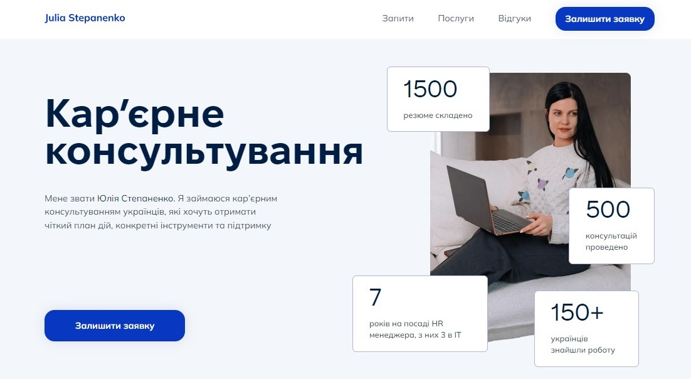

# Career consultant

**[WELCOME TO LIVE PAGE]()**

<>

</>

  <a href="#introduction">Introduction</a> •
  <a href="#sections">Sections</a> •
  <a href="#components-api">Components API</a> •
  <a href="#credits">Credits</a> •
  <a href="#related">Related</a> •
  <a href="#license">License</a>

## Introduction

`Career consultant` is a web application aimed at career counseling for
Ukrainians who want to receive a clear action plan, practical tools, and
support.

## Sections

## Components API

## Credits

This software uses the following open source packages:

- [Next.js](https://nextjs.org/)
- [Sanity](https://www.sanity.io/)
- [TypeScript](https://www.typescriptlang.org/)
- [Tailwindcss](https://tailwindcss.com/)
- [HeadlessUI](https://headlessui.com/)
- [Swiper](https://swiperjs.com/)
- [react-scroll](https://www.npmjs.com/package/react-scroll)
- [react-hook-form](https://react-hook-form.com/)
- [svgr](https://www.npmjs.com/package/@svgr/webpack)
- [classnames](https://www.npmjs.com/package/classnames)
